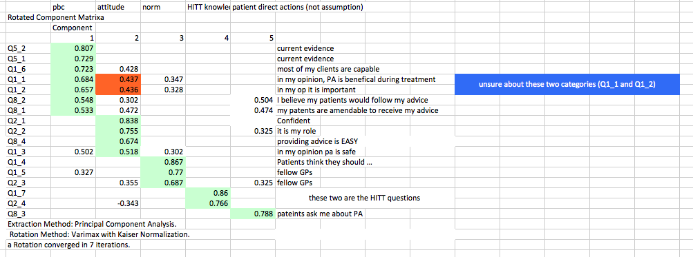
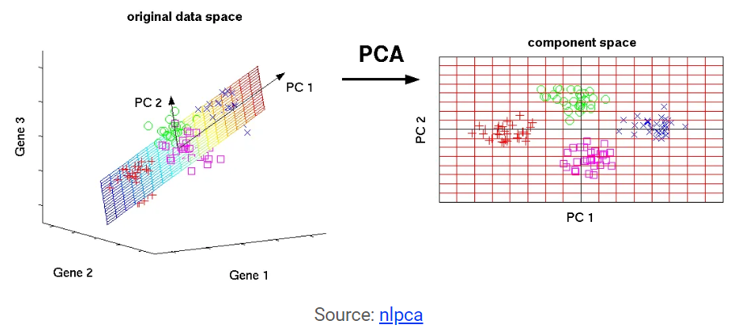

# Introduction {#intro}

You can label chapter and section titles using `{#label}` after them, e.g., we can reference Chapter \@ref(intro). If you do not manually label them, there will be automatic labels anyway, e.g., Chapter \@ref(methods).

Figures and tables with captions will be placed in `figure` and `table` environments, respectively.

```{r nice-figsdv, fig.cap='Here is a nice figure!', out.width='80%', fig.asp=.75, fig.align='center'}
par(mar = c(4, 4, .1, .1))
plot(pressure, type = 'b', pch = 19)
```

Reference a figure by its code chunk label with the `fig:` prefix, e.g., see Figure \@ref(fig:nice-fig). Similarly, you can reference tables generated from `knitr::kable()`, e.g., see Table \@ref(tab:nice-tab).

```{r nice-tabdsv, tidy=FALSE}
knitr::kable(
  head(iris, 20), caption = 'Here is a nice table!',
  booktabs = TRUE
)
```

You can write citations, too. For example, we are using the **bookdown** package [@R-bookdown] in this sample book, which was built on top of R Markdown and **knitr** [@xie2015].

```{r setupwf, include = FALSE}
knitr::opts_chunk$set(
  collapse = TRUE,
  comment = "#>"
)
```

```{r load_packagergres, message=FALSE, warning=FALSE, include=FALSE}
library(DiagrammeR)
```

### Email replies in more detail

I have just copied a few simple tutorials online incase you need a few resources.

*Im currently running an EFA* **(sorry im not sure is this shorthand stands for?)** *and I'm totally unsure of the cross-loading of some of the components!*

This is often the case when the relationships are weak or the power of the study is too low.

*I have attached output (it is the final rotated component matrix) as i have removed specific questions.* 

*I would like to move onto a multiple regression analysis or something to determine meaningful results from my questionnaire however I'm just super unsure of ways to move forward* **I have started this in the report below but just need to sit down with some of your data I think**.

*What are your thoughts on the cross loading?* **Depends on the power of the data mostly I think** 

as a general, the components are almost fitting well with the theory i generated the survey around (the theory of planned behaviour)- into attitudes, norms and perceived behaviours but due to the multiple weighings, I'm unsure how to get a full understanding of seperation. **This is a very hard question generally. Happy to discuss**

## Overall

Here I have put together a draft of some simple mixed models that can be looked at after the proposed objectives/hypothesis are laid out. It can sometimes be good to think of these sorts of problems as process diagrams as I have given below as an example

### Principal component analysis

"In simple words, principal component analysis is a method of extracting important variables (in form of components) from a large set of variables available in a data set. It extracts low dimensional set of features from a high dimensional data set with a motive to capture as much information as possible. With fewer variables, visualization also becomes much more meaningful. PCA is more useful when dealing with 3 or higher dimensional data." [ref: here](https://www.analyticsvidhya.com/blog/2016/03/practical-guide-principal-component-analysis-python/).



**NOTE:** It is always performed on a symmetric correlation or covariance matrix. This means the matrix should be numeric and have standardized data.

And results often look like this by plotting the first and second dimentions like so...


**NOTE** Any more than two diamentions are often hard to interperate and impossible if the power is low. To understand the number of diamentions needed the eigen values and vectors can be investigated.

### Normalization

The principal component analysis should be fitted to a normalized version of original predictors/variables collected. This is because, the original data may have different scales. 

**For example:** Imagine a data set with variables’ measuring units as gallons, kilometers, light years etc. It is definite that the scale of variances in these variables will be large.

Performing PCA on un-normalized variables will lead to insanely large loadings for variables with high variance. In turn, this will lead to dependence of a principal component on the variable with high variance. This is undesirable.

### Mixed models

Mixed models essentially start with sample mean differences between groups and then add additional complexity in favour of poor fitting models.

You can write out models and variable relationships using statistical equations such as:

$$ outcome = \beta_0 + \beta_1(sex_i)$$
where the variables can be collected either through direct questions or transformed data from the orginal questions. What does it look like in a diagram explaining how the variables are proposed to be similar? Example below:

```{r include = FALSE}
grViz("
digraph boxes_and_circles {

  # a 'graph' statement
  graph [overlap = true, fontsize = 10]

  # several 'node' statements
  node [shape = box,
        fontname = Helvetica]
  Q1; Q2; Q3; Q4; Q5; Q6

  node [shape = circle,
        fixedsize = true,
        width = 0.9] // sets as circles
  1; 2; 3; 4; 5; 6; 7; 8

  # several 'edge' statements
  Q1->1 Q1->2 Q1->3 Q2->4 Q3->A
  Q3->D Q5->A Q2->4 Q2->5 Q6->F
  E->6 4->6 5->7 6->7 3->8
}
")
```

For example you might think that generally individuals that ...

$$ outcome = \beta_0 + \beta_1(sex_i) + \beta(age_i) + error_i $$

```{r include=FALSE}
grViz("
digraph boxes_and_circles {

  # a 'graph' statement
  graph [overlap = true, fontsize = 10]

  # several 'node' statements
  node [shape = box,
        fontname = Helvetica]
  b0; b1; b2; error

  node [shape = circle,
        fixedsize = true,
        width = 0.9] // sets as circles
  sex; age; 
  
  # several 'edge' statements
  b1->sex; b2->age
}
")
```
